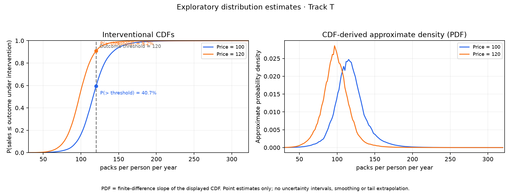

Analysis policy: 3.5 API only; stop when quota is exhausted. 

Actual model: **TabPFN v3.5_default** (development_only).

# Agentic TabCF report

### Distributional analysis — Track T · Real data · Exploratory estimates

Prices: 100 to 120 CPI-deflated cents per pack. All differences are 120 minus 100.

State-year sales per capita; each observation has equal weight.

**Sales quantiles**

Levels and changes are in packs per person per year. Each row describes a percentile of the estimated sales distribution; the median is the 50th percentile.

| Quantile | Price 100 | Price 120 | Change (120 − 100) |
|:---|---:|---:|---:|
| 25% | 105.2 | 87.8 | -17.4 |
| 50% | 116.1 | 97.9 | -18.2 |
| 75% | 128.0 | 108.3 | -19.6 |

**Probability above the specified sales threshold**

Sales strictly exceeding 120 packs per person per year. Levels are percentages; the change is in percentage points.

| Price 100 (%) | Price 120 (%) | Change (percentage points) |
|---:|---:|---:|
| 40.7 | 9.2 | -31.5 |

Technical appendix and evidence index

- Run ID: `run_72e0e4a81aac75e7a91f3dbd`
- Result bundle: `bundle_1ad75ce59ff0d82cc0aaa651`
- Specification: `spec_a064ead36dbca836edd74e49`
- Dataset hash: `sha256:fae33858f487366d0acaaab719b693615cbcca3ecf7de75e67e209c441e9029d`
- Evidence status: `development_only`

Diagnostic values and support assessments are retained in result_bundle.json.

| Reference | Query | Validated value | Evidence ID |
|---|---|---|---|
| [1] | `quantile:0.25:0` | 105.168 packs per person per year | `evidence_98f88dff3bab1bd2bb480fe7` |
| [2] | `quantile:0.25:1` | 87.8116 packs per person per year | `evidence_ce603c058f7d27bd3048c3df` |
| [3] | `quantile_difference:0.25` | -17.3564 packs per person per year | `evidence_de9e8136b009663d1fee9778` |
| [4] | `quantile:0.5:0` | 116.112 packs per person per year | `evidence_1c42ff4536b23fae5186a635` |
| [5] | `quantile:0.5:1` | 97.8796 packs per person per year | `evidence_8ed8088cfb76656ba0a02d51` |
| [6] | `quantile_difference:0.5` | -18.2323 packs per person per year | `evidence_acbdce12014dc48bae643266` |
| [7] | `quantile:0.75:0` | 127.953 packs per person per year | `evidence_6539e9d11138b926f1ac4503` |
| [8] | `quantile:0.75:1` | 108.335 packs per person per year | `evidence_ddc9d25f234b8d432bff8d02` |
| [9] | `quantile_difference:0.75` | -19.6176 packs per person per year | `evidence_b52aa7910e614ad44c41b517` |
| [10] | `threshold_cdf:0` | 0.593076 probability | `evidence_a664e8484409e6c807d41cfb` |
| [11] | `threshold_cdf:1` | 0.90824 probability | `evidence_a98d41c2b175845c3b214053` |
| [12] | `exceedance:0` | 40.6924 percent | `evidence_bf67751a3011672d7d8a8bd4` |
| [13] | `exceedance:1` | 9.17602 percent | `evidence_b50ad86d781dbcfcaa27ab88` |
| [14] | `exceedance_difference` | -31.5164 percentage points | `evidence_2535b8a2344959e3ad33bfba` |
| [15] | `cdf:0:0` | 0.000208207 probability | `evidence_a8fbf30b3e5056b5c80241ba` |
| [16] | `cdf:0:1` | 0.000215691 probability | `evidence_473df35b919862ac50dcdd3f` |
| [17] | `cdf:0:2` | 0.000223651 probability | `evidence_14d1717b567c23b037f84bc7` |
| [18] | `cdf:0:3` | 0.000232196 probability | `evidence_01863820caa138a02200f314` |
| [19] | `cdf:0:4` | 0.000241883 probability | `evidence_df213bacf1bace6c914c5c23` |
| [20] | `cdf:0:5` | 0.000251508 probability | `evidence_4d623025218c265b97cbb6ce` |
| [21] | `cdf:0:6` | 0.000261934 probability | `evidence_b32afef45ff2d479b15cd16c` |
| [22] | `cdf:0:7` | 0.000272802 probability | `evidence_bb60c79c77e20de0cb4f1cb9` |
| [23] | `cdf:0:8` | 0.0002845 probability | `evidence_85a56df1d9c7482d332f5f4c` |
| [24] | `cdf:0:9` | 0.000296659 probability | `evidence_6cf2bd7668911ee99e243d26` |
| [25] | `cdf:0:10` | 0.00030989 probability | `evidence_8c467683bcac657b657d9e31` |
| [26] | `cdf:0:11` | 0.000324164 probability | `evidence_5690b5cb99899c24a85b7de2` |
| [27] | `cdf:0:12` | 0.000339774 probability | `evidence_73b847c43b665c15a3b9e5a5` |
| [28] | `cdf:0:13` | 0.000356313 probability | `evidence_7438fca998aa4a17d7b3fa70` |
| [29] | `cdf:0:14` | 0.000375016 probability | `evidence_33ba19c2f7e21bc3313254d0` |
| [30] | `cdf:0:15` | 0.000395693 probability | `evidence_2eb82663f2f7b6239af53486` |
| [31] | `cdf:0:16` | 0.000417172 probability | `evidence_fd932d38b5472439498b04af` |
| [32] | `cdf:0:17` | 0.00044066 probability | `evidence_277d78d2bae6a2411dd05d2c` |
| [33] | `cdf:0:18` | 0.000466358 probability | `evidence_e8da90f814f70c1a2bae9cfa` |
| [34] | `cdf:0:19` | 0.000494236 probability | `evidence_887d7578dd2852b7c6467cc3` |
| [35] | `cdf:0:20` | 0.000525109 probability | `evidence_75363c613cdb0c14fe28a591` |
| [36] | `cdf:0:21` | 0.000559934 probability | `evidence_651960cf9377f7a7061b7e81` |
| [37] | `cdf:0:22` | 0.000596041 probability | `evidence_32b5fcdbc25c837d2d88f691` |
| [38] | `cdf:0:23` | 0.000636067 probability | `evidence_754532081e2e14eabf6863fd` |
| [39] | `cdf:0:24` | 0.000679544 probability | `evidence_8a10cb3b77661ad25dead631` |
| [40] | `cdf:0:25` | 0.000726328 probability | `evidence_77a88961102d64d15995a59c` |
| [41] | `cdf:0:26` | 0.000775742 probability | `evidence_98e1b749c99ecae643a68013` |
| [42] | `cdf:0:27` | 0.00083101 probability | `evidence_37bfe9dd191efbdfb9f66da0` |
| [43] | `cdf:0:28` | 0.000888528 probability | `evidence_32cd283e4062c243a76935ca` |
| [44] | `cdf:0:29` | 0.000951791 probability | `evidence_7b248301b6b6a2a4a1fefc9a` |
| [45] | `cdf:0:30` | 0.00102306 probability | `evidence_b87786c5206e1a93c7e61ce0` |
| [46] | `cdf:0:31` | 0.00110109 probability | `evidence_08365407808dbbddd0e79ab6` |
| [47] | `cdf:0:32` | 0.00118632 probability | `evidence_5b9651c6e5f9557f072649ac` |
| [48] | `cdf:0:33` | 0.00127975 probability | `evidence_590960ca2edc9b0dd27defee` |
| [49] | `cdf:0:34` | 0.00137946 probability | `evidence_fe58d83072ece8a4a9cd0a49` |
| [50] | `cdf:0:35` | 0.00149461 probability | `evidence_02d69a37ff447eec436d05cb` |
| [51] | `cdf:0:36` | 0.00162526 probability | `evidence_2d699556323343b9abf20005` |
| [52] | `cdf:0:37` | 0.00177182 probability | `evidence_b2e75e581fd7ac9d14455373` |
| [53] | `cdf:0:38` | 0.0019319 probability | `evidence_c04e868cce19a7f460487d04` |
| [54] | `cdf:0:39` | 0.00210826 probability | `evidence_99026af078d3e5803c576999` |
| [55] | `cdf:0:40` | 0.0023011 probability | `evidence_a1665cf9a64c40e1bcbd1c5c` |
| [56] | `cdf:0:41` | 0.00250422 probability | `evidence_238416b2dcf4595cd85e1fc2` |
| [57] | `cdf:0:42` | 0.0027235 probability | `evidence_8453bebc3aeb9b3bd6d18a6c` |
| [58] | `cdf:0:43` | 0.00296803 probability | `evidence_8bc32f76b4f0faec0b7521ef` |
| [59] | `cdf:0:44` | 0.00323529 probability | `evidence_45fb3577be884c8c41f332c2` |
| [60] | `cdf:0:45` | 0.00353522 probability | `evidence_2438ba0336d733218f825f68` |
| [61] | `cdf:0:46` | 0.00386913 probability | `evidence_d588b8dc78937689e1e17d3a` |
| [62] | `cdf:0:47` | 0.0042399 probability | `evidence_d489b9f25b2e2e050ac6a652` |
| [63] | `cdf:0:48` | 0.00465023 probability | `evidence_4df9b456890810a01a64cab9` |
| [64] | `cdf:0:49` | 0.00509965 probability | `evidence_441955a2f2ed7783bd181787` |
| [65] | `cdf:0:50` | 0.00559418 probability | `evidence_26d36eedcf5549284b66a0c7` |
| [66] | `cdf:0:51` | 0.0061163 probability | `evidence_79bc2d8ef077f0610146f301` |
| [67] | `cdf:0:52` | 0.00671029 probability | `evidence_7b74ac0f260c02a18a9a0a6d` |
| [68] | `cdf:0:53` | 0.00736057 probability | `evidence_ac74d3a2c5de32db2d4e7101` |
| [69] | `cdf:0:54` | 0.00810099 probability | `evidence_8a4b6e48e6c3a789d0bde644` |
| [70] | `cdf:0:55` | 0.00895046 probability | `evidence_720a3e04c5638920f341aad7` |
| [71] | `cdf:0:56` | 0.00989233 probability | `evidence_54dd6c948106873a31b1a126` |
| [72] | `cdf:0:57` | 0.0108841 probability | `evidence_455c9758bdb26a2c9bcdf3be` |
| [73] | `cdf:0:58` | 0.0119431 probability | `evidence_630f5b402abee1f6a9a66c03` |
| [74] | `cdf:0:59` | 0.0131124 probability | `evidence_1cdc1ccaa345b4236ec90ec8` |
| [75] | `cdf:0:60` | 0.0144176 probability | `evidence_d3951d3373f0d74ee46d888d` |
| [76] | `cdf:0:61` | 0.0158627 probability | `evidence_ad8159d2795536baf2a12e2e` |
| [77] | `cdf:0:62` | 0.017565 probability | `evidence_b0b24fd8b577a69e0c3ee0bd` |
| [78] | `cdf:0:63` | 0.0194444 probability | `evidence_feb3aafb1a58f746b38bfe59` |
| [79] | `cdf:0:64` | 0.0214179 probability | `evidence_d945439bbe1129fdb2b5c418` |
| [80] | `cdf:0:65` | 0.0236492 probability | `evidence_b42bd21e85539f8bdc12651c` |
| [81] | `cdf:0:66` | 0.0261741 probability | `evidence_bc0993ca6bcb44f8c1b432eb` |
| [82] | `cdf:0:67` | 0.028897 probability | `evidence_559019f7ff6878844b7f1525` |
| [83] | `cdf:0:68` | 0.0319329 probability | `evidence_1646fe5d8372867da40ba520` |
| [84] | `cdf:0:69` | 0.0356439 probability | `evidence_0875ded633ea58378abba1bc` |
| [85] | `cdf:0:70` | 0.0401253 probability | `evidence_819d9d2d44b6557f6cbbdecd` |
| [86] | `cdf:0:71` | 0.0454944 probability | `evidence_b21ee4d6d8f14cf5c9c63120` |
| [87] | `cdf:0:72` | 0.0517107 probability | `evidence_a41eae1630b771e221f2041f` |
| [88] | `cdf:0:73` | 0.058893 probability | `evidence_7efb0c886921a8e2df91bcf3` |
| [89] | `cdf:0:74` | 0.0674576 probability | `evidence_92cae15dd49ae33215890652` |
| [90] | `cdf:0:75` | 0.0771542 probability | `evidence_e377db16a869a9cefc66da07` |
| [91] | `cdf:0:76` | 0.0877364 probability | `evidence_47efa4fbf97c819f7e5730d3` |
| [92] | `cdf:0:77` | 0.0994682 probability | `evidence_6318add737f080e7cb223875` |
| [93] | `cdf:0:78` | 0.11283 probability | `evidence_0feb6c7d8c9fef954833ed27` |
| [94] | `cdf:0:79` | 0.12871 probability | `evidence_26ae223f292c172a31ae4945` |
| [95] | `cdf:0:80` | 0.146647 probability | `evidence_ff01b1c04949534747a971a9` |
| [96] | `cdf:0:81` | 0.166654 probability | `evidence_3bdd07cc33a7d48605cec9cd` |
| [97] | `cdf:0:82` | 0.189461 probability | `evidence_0b473a78b95a7474bcfb3ccd` |
| [98] | `cdf:0:83` | 0.214021 probability | `evidence_9c0986301fb236ede3aa10e1` |
| [99] | `cdf:0:84` | 0.242201 probability | `evidence_c9c96d985b57fd47488ce28c` |
| [100] | `cdf:0:85` | 0.273793 probability | `evidence_1fcd805242d4ef33a03f71ea` |
| [101] | `cdf:0:86` | 0.307744 probability | `evidence_5f8b122f21c4219548aa98cd` |
| [102] | `cdf:0:87` | 0.344336 probability | `evidence_7c51030cadbcb0a8df344f17` |
| [103] | `cdf:0:88` | 0.379664 probability | `evidence_b9c4c601a765de82cba804b3` |
| [104] | `cdf:0:89` | 0.419601 probability | `evidence_9703dab9615769eabe4df22b` |
| [105] | `cdf:0:90` | 0.460153 probability | `evidence_63fafaa454fb32d3cb4bf1d2` |
| [106] | `cdf:0:91` | 0.502288 probability | `evidence_403db349f23e70e132195806` |
| [107] | `cdf:0:92` | 0.544145 probability | `evidence_615cfbd60ae2bc309329d45a` |
| [108] | `cdf:0:93` | 0.586119 probability | `evidence_ac42167f789c1fbbc0e9a646` |
| [109] | `cdf:0:94` | 0.625992 probability | `evidence_b6740d48a677a899295b030c` |
| [110] | `cdf:0:95` | 0.664109 probability | `evidence_a1ef81610b3700af660fb1ce` |
| [111] | `cdf:0:96` | 0.70058 probability | `evidence_18c65f7472f92b5ea9be280e` |
| [112] | `cdf:0:97` | 0.734085 probability | `evidence_6892fa9e291a4f08d29f03f9` |
| [113] | `cdf:0:98` | 0.764875 probability | `evidence_d44ae2e82b7ca8d85d24cabb` |
| [114] | `cdf:0:99` | 0.792992 probability | `evidence_b643da2d7eacb27eaa296bde` |
| [115] | `cdf:0:100` | 0.818307 probability | `evidence_845e69e8dfeaf033628205f8` |
| [116] | `cdf:0:101` | 0.840384 probability | `evidence_449ab450c539a1bdc41fb8d2` |
| [117] | `cdf:0:102` | 0.858839 probability | `evidence_27dbda125ba3f4c88e747fe3` |
| [118] | `cdf:0:103` | 0.875678 probability | `evidence_1416fbe70895e60170cb2b25` |
| [119] | `cdf:0:104` | 0.891067 probability | `evidence_7993a11c5ac3fd0212c383ca` |
| [120] | `cdf:0:105` | 0.904318 probability | `evidence_74d12abe9f057d36072137f8` |
| [121] | `cdf:0:106` | 0.916817 probability | `evidence_670f924ff071a07243c58999` |
| [122] | `cdf:0:107` | 0.927713 probability | `evidence_fa6b76fe4056f36bc4343327` |
| [123] | `cdf:0:108` | 0.936404 probability | `evidence_cc66e192216acb0e16fcad8e` |
| [124] | `cdf:0:109` | 0.944539 probability | `evidence_be36d04f8c8c70f8dcb8df02` |
| [125] | `cdf:0:110` | 0.951564 probability | `evidence_052b5527d70d050ccb4156b0` |
| [126] | `cdf:0:111` | 0.95773 probability | `evidence_3f6948c95f5efcc8492b7091` |
| [127] | `cdf:0:112` | 0.963001 probability | `evidence_ba9a5736e582f3ab06abd1ce` |
| [128] | `cdf:0:113` | 0.96765 probability | `evidence_f087017cab07c8da240850f9` |
| [129] | `cdf:0:114` | 0.971724 probability | `evidence_7e73325ad511c5f5e26eed24` |
| [130] | `cdf:0:115` | 0.975441 probability | `evidence_3eb4c9ec19860bd5da7890b7` |
| [131] | `cdf:0:116` | 0.978673 probability | `evidence_401af225d4f6227fa5b5b8e9` |
| [132] | `cdf:0:117` | 0.981522 probability | `evidence_17bdf830bfdd6539652f6368` |
| [133] | `cdf:0:118` | 0.98399 probability | `evidence_10dd5b1cbe704d49b4fcafea` |
| [134] | `cdf:0:119` | 0.986102 probability | `evidence_6b75523894d7211a872837f3` |
| [135] | `cdf:0:120` | 0.987912 probability | `evidence_65da9085d1579aa6ecfaf5fb` |
| [136] | `cdf:0:121` | 0.989498 probability | `evidence_69d83303331e19576e8f56a9` |
| [137] | `cdf:0:122` | 0.990878 probability | `evidence_f081a617efbec5096706ed34` |
| [138] | `cdf:0:123` | 0.992042 probability | `evidence_a86ac904cfd40b0b3e7fe333` |
| [139] | `cdf:0:124` | 0.993017 probability | `evidence_f12d6c66b8584a5182eb4e8d` |
| [140] | `cdf:0:125` | 0.99384 probability | `evidence_9c711a6859a2f338609e52fb` |
| [141] | `cdf:0:126` | 0.994581 probability | `evidence_daede78547f2b240ab112fa2` |
| [142] | `cdf:0:127` | 0.995208 probability | `evidence_6914c05170b93d2ad131d829` |
| [143] | `cdf:0:128` | 0.995737 probability | `evidence_50f6f0a94bbe533e9a41395f` |
| [144] | `cdf:0:129` | 0.996206 probability | `evidence_c9cc8d35f887df8d62ed784d` |
| [145] | `cdf:0:130` | 0.996627 probability | `evidence_ef44312dfe4569f4d110f5c5` |
| [146] | `cdf:0:131` | 0.996997 probability | `evidence_7dd69761d7932edff7bb7138` |
| [147] | `cdf:0:132` | 0.997319 probability | `evidence_a83847e3bb8edbec8e86cca6` |
| [148] | `cdf:0:133` | 0.997602 probability | `evidence_46b7b8d1fbbb6ad2e6932f18` |
| [149] | `cdf:0:134` | 0.997854 probability | `evidence_b190eaef2816f7ddcb5a1a0c` |
| [150] | `cdf:0:135` | 0.998073 probability | `evidence_f2c5b0da96df37fd3a8137a2` |
| [151] | `cdf:0:136` | 0.998258 probability | `evidence_c9cb01500ac9878e9fa9bba6` |
| [152] | `cdf:0:137` | 0.99842 probability | `evidence_d0e6ea0a86f019216bf42cbd` |
| [153] | `cdf:0:138` | 0.998561 probability | `evidence_871add57f7314d781c058f3b` |
| [154] | `cdf:0:139` | 0.998684 probability | `evidence_45610117b8d6cc4d2d09c28a` |
| [155] | `cdf:0:140` | 0.998793 probability | `evidence_d90e0f57a80be95b0d9aee69` |
| [156] | `cdf:0:141` | 0.998891 probability | `evidence_177048a5b347ed7808cea519` |
| [157] | `cdf:0:142` | 0.998978 probability | `evidence_17d959c543e53d345d907251` |
| [158] | `cdf:0:143` | 0.999059 probability | `evidence_aac05e46816ca8dafbfcb906` |
| [159] | `cdf:0:144` | 0.999131 probability | `evidence_5a33ce2761c05d3a02015327` |
| [160] | `cdf:0:145` | 0.999194 probability | `evidence_541fae4b1a0d770968ef99ea` |
| [161] | `cdf:0:146` | 0.999251 probability | `evidence_0bdf723b9adcfd3cc1f7ec70` |
| [162] | `cdf:0:147` | 0.999305 probability | `evidence_69ff904cc4290f975cecd6c7` |
| [163] | `cdf:0:148` | 0.999352 probability | `evidence_25ef700d13296ee01c5fcc28` |
| [164] | `cdf:0:149` | 0.999395 probability | `evidence_a56f389d26ac1ab85d1c64d6` |
| [165] | `cdf:0:150` | 0.999435 probability | `evidence_54a47584b1ae1bb8359b26e4` |
| [166] | `cdf:0:151` | 0.999471 probability | `evidence_a6b6f921991fa31c57b60953` |
| [167] | `cdf:0:152` | 0.999504 probability | `evidence_5dc6ee84a0de4f7fab46c64c` |
| [168] | `cdf:0:153` | 0.999533 probability | `evidence_ba98cacb46546f367ad47873` |
| [169] | `cdf:0:154` | 0.99956 probability | `evidence_6cce9d5b5356b3072178dd50` |
| [170] | `cdf:0:155` | 0.999584 probability | `evidence_37588c80198d36ba49fb5046` |
| [171] | `cdf:0:156` | 0.999608 probability | `evidence_63dea6237682d666c6370e55` |
| [172] | `cdf:0:157` | 0.999629 probability | `evidence_7459fa9753fae4591e487d92` |
| [173] | `cdf:0:158` | 0.999648 probability | `evidence_bc0002b24a4b67e6789a16f8` |
| [174] | `cdf:0:159` | 0.999666 probability | `evidence_8756af59bb3eb89ba69cd1ce` |
| [175] | `cdf:0:160` | 0.999683 probability | `evidence_b8591daf954f987e4cd1ef8e` |
| [176] | `cdf:1:0` | 0.0004022 probability | `evidence_7472fb341746634650d49cb7` |
| [177] | `cdf:1:1` | 0.000420871 probability | `evidence_11d1c67174531a075c2e0197` |
| [178] | `cdf:1:2` | 0.000440862 probability | `evidence_76528fe5d5d2ad2325828cee` |
| [179] | `cdf:1:3` | 0.000462047 probability | `evidence_8385f50f68847a58c6513ace` |
| [180] | `cdf:1:4` | 0.000485814 probability | `evidence_2bb50eb4d45b0c84b172e55f` |
| [181] | `cdf:1:5` | 0.000509573 probability | `evidence_b1bade7480806730f9c6448e` |
| [182] | `cdf:1:6` | 0.000535192 probability | `evidence_bcf18d39b598dcbe2d57ac82` |
| [183] | `cdf:1:7` | 0.000562245 probability | `evidence_37b7ff1aef6e512e0fccdad6` |
| [184] | `cdf:1:8` | 0.000592183 probability | `evidence_0e4c4bba11609cbb03bd7cfe` |
| [185] | `cdf:1:9` | 0.000623933 probability | `evidence_3a5544037d762f13a6319395` |
| [186] | `cdf:1:10` | 0.00065888 probability | `evidence_26ca0a617b40361a0c098c98` |
| [187] | `cdf:1:11` | 0.000696345 probability | `evidence_346474b225978a3463234490` |
| [188] | `cdf:1:12` | 0.000737012 probability | `evidence_d0c444e7eff74c8234ba0dd2` |
| [189] | `cdf:1:13` | 0.000781315 probability | `evidence_94fb50e80fcbbf821956ccd0` |
| [190] | `cdf:1:14` | 0.000832943 probability | `evidence_ec448607c32f82f2858f7e23` |
| [191] | `cdf:1:15` | 0.000889572 probability | `evidence_586d0dda5ae6be4f6734a1d5` |
| [192] | `cdf:1:16` | 0.000949858 probability | `evidence_7c5e6680705a41dc8723b7eb` |
| [193] | `cdf:1:17` | 0.00101836 probability | `evidence_f089f94135dbb8feaf5f28f3` |
| [194] | `cdf:1:18` | 0.00109352 probability | `evidence_8a558165e439e7ed7675224c` |
| [195] | `cdf:1:19` | 0.00117733 probability | `evidence_f32a738a410e0754744ddb96` |
| [196] | `cdf:1:20` | 0.0012697 probability | `evidence_0d839f6dde48f79c9efab468` |
| [197] | `cdf:1:21` | 0.00137493 probability | `evidence_53ad9317f18c01cb6ed4fc7c` |
| [198] | `cdf:1:22` | 0.00149175 probability | `evidence_c099206374b03132478ef75e` |
| [199] | `cdf:1:23` | 0.0016225 probability | `evidence_234032a0fae017ccfdda6328` |
| [200] | `cdf:1:24` | 0.00176374 probability | `evidence_8139c5aa56e8128cd95f1bd6` |
| [201] | `cdf:1:25` | 0.00191852 probability | `evidence_202653b352b43b9299263953` |
| [202] | `cdf:1:26` | 0.00209049 probability | `evidence_776f58a6ab6b09c9c622aa07` |
| [203] | `cdf:1:27` | 0.00228014 probability | `evidence_e77b80dfe30bbe297fe3cfc4` |
| [204] | `cdf:1:28` | 0.00248652 probability | `evidence_bd7fce63904faf95ff784246` |
| [205] | `cdf:1:29` | 0.00271347 probability | `evidence_3f9b19245e2d53b2793f69a4` |
| [206] | `cdf:1:30` | 0.00297051 probability | `evidence_afc286844c50fd92623ba0f0` |
| [207] | `cdf:1:31` | 0.00325779 probability | `evidence_0f6bfd72d2aaa42c8bd6cf32` |
| [208] | `cdf:1:32` | 0.00358019 probability | `evidence_4c8a0e422fc378acdd79059d` |
| [209] | `cdf:1:33` | 0.00394177 probability | `evidence_ad8b6be6bd85f1d4888133ae` |
| [210] | `cdf:1:34` | 0.00434776 probability | `evidence_6e8b2c0cf7b0ba9fafc2eea6` |
| [211] | `cdf:1:35` | 0.0048144 probability | `evidence_eb5d0b14d118982442227731` |
| [212] | `cdf:1:36` | 0.00534056 probability | `evidence_0e675e9d05c63d86f387812d` |
| [213] | `cdf:1:37` | 0.00594299 probability | `evidence_725ecf60e2f3eab62b91e8fc` |
| [214] | `cdf:1:38` | 0.00661015 probability | `evidence_2b46bb9ebdc7190a31481974` |
| [215] | `cdf:1:39` | 0.00735372 probability | `evidence_f780fbf0dae815681901fd2f` |
| [216] | `cdf:1:40` | 0.00818447 probability | `evidence_412c0418a6e1731982f439e9` |
| [217] | `cdf:1:41` | 0.00908191 probability | `evidence_5fcfe90906c9bdf7f4fb3094` |
| [218] | `cdf:1:42` | 0.0100634 probability | `evidence_2a88e6ffee95b8329dded358` |
| [219] | `cdf:1:43` | 0.011156 probability | `evidence_c12aa7615d93793f188d42c6` |
| [220] | `cdf:1:44` | 0.012373 probability | `evidence_cdf04e19cc55939bf8dd376c` |
| [221] | `cdf:1:45` | 0.0137341 probability | `evidence_35c3005fde1a6cf92ae0ca8c` |
| [222] | `cdf:1:46` | 0.0152557 probability | `evidence_5723cfc8faeef77ca3ba3f97` |
| [223] | `cdf:1:47` | 0.0169171 probability | `evidence_64b9891bd880cd108d73c43e` |
| [224] | `cdf:1:48` | 0.0187604 probability | `evidence_5d145ac621a74ef214a1eb0f` |
| [225] | `cdf:1:49` | 0.020834 probability | `evidence_a71b66a8312bf1605a40b9d2` |
| [226] | `cdf:1:50` | 0.0231388 probability | `evidence_21941dfe4bd480a21d913a95` |
| [227] | `cdf:1:51` | 0.0256562 probability | `evidence_bd62c4d34fa9ac7fdc99a7db` |
| [228] | `cdf:1:52` | 0.0285538 probability | `evidence_785f25d3624b5ca628acf4ea` |
| [229] | `cdf:1:53` | 0.0318039 probability | `evidence_20c32b92144e7c10a4a0abd7` |
| [230] | `cdf:1:54` | 0.0354041 probability | `evidence_8ff8f16a4ddf5c1c2a82fdd7` |
| [231] | `cdf:1:55` | 0.0394714 probability | `evidence_f3831426a6c4cd7fe1c1c164` |
| [232] | `cdf:1:56` | 0.0441033 probability | `evidence_f1a28148d0a331336469e535` |
| [233] | `cdf:1:57` | 0.0490662 probability | `evidence_febd6e449a3d1990b2351137` |
| [234] | `cdf:1:58` | 0.0544028 probability | `evidence_1c000ab448ac1bb2d221cc3d` |
| [235] | `cdf:1:59` | 0.060578 probability | `evidence_c0ab3be2e3bd16adba35a2a9` |
| [236] | `cdf:1:60` | 0.0675086 probability | `evidence_990a1b264c59fc3ae332ca95` |
| [237] | `cdf:1:61` | 0.0749767 probability | `evidence_6422838a4689df2991c3dfb9` |
| [238] | `cdf:1:62` | 0.0837752 probability | `evidence_1cf47d3249eb4beb0d2d1774` |
| [239] | `cdf:1:63` | 0.0935475 probability | `evidence_35ffc50408d4fc7fbe4d5ee1` |
| [240] | `cdf:1:64` | 0.104009 probability | `evidence_979ce2b1a16a9c5466a99b4d` |
| [241] | `cdf:1:65` | 0.116253 probability | `evidence_7bc534ead901abf569522636` |
| [242] | `cdf:1:66` | 0.130111 probability | `evidence_3ad884aec0febb015651acde` |
| [243] | `cdf:1:67` | 0.145131 probability | `evidence_4b7099c532c626cf1e39e4a2` |
| [244] | `cdf:1:68` | 0.161644 probability | `evidence_05c05b52d8b30b75c09baa19` |
| [245] | `cdf:1:69` | 0.180578 probability | `evidence_6a198478dc90695cb592d5c4` |
| [246] | `cdf:1:70` | 0.20166 probability | `evidence_8d995c7f80989ca7b709224f` |
| [247] | `cdf:1:71` | 0.224805 probability | `evidence_a0cd85a6bac00737ccc3900d` |
| [248] | `cdf:1:72` | 0.248889 probability | `evidence_5dc1b68245c7d2a3f65dac81` |
| [249] | `cdf:1:73` | 0.275369 probability | `evidence_4dcae426ef5271f1a4c877a2` |
| [250] | `cdf:1:74` | 0.304882 probability | `evidence_36c5272a85bf0e97f4b0a76c` |
| [251] | `cdf:1:75` | 0.336987 probability | `evidence_0709ec1cdbbf86cbc6c3cfef` |
| [252] | `cdf:1:76` | 0.370818 probability | `evidence_c7cd12413e3d21bd1a72cc58` |
| [253] | `cdf:1:77` | 0.407068 probability | `evidence_3bcc0139b833631487f2d25c` |
| [254] | `cdf:1:78` | 0.443729 probability | `evidence_2bce836ecd17c81864e5f25d` |
| [255] | `cdf:1:79` | 0.484512 probability | `evidence_4a59bfc8afbed227d45896f1` |
| [256] | `cdf:1:80` | 0.524541 probability | `evidence_dca9461f9332048358679800` |
| [257] | `cdf:1:81` | 0.563716 probability | `evidence_0c321a87e672405044b36310` |
| [258] | `cdf:1:82` | 0.601477 probability | `evidence_3c651800bbbc42437adb860a` |
| [259] | `cdf:1:83` | 0.63747 probability | `evidence_138a163bb135808994cf3a08` |
| [260] | `cdf:1:84` | 0.67354 probability | `evidence_7170e7b013b08d39e17253c0` |
| [261] | `cdf:1:85` | 0.708565 probability | `evidence_18007ac886bc375a85e8da2d` |
| [262] | `cdf:1:86` | 0.741996 probability | `evidence_3e72e9deb75d221e2f6ae8d6` |
| [263] | `cdf:1:87` | 0.773403 probability | `evidence_c3a825f9e4f9bb45bd344463` |
| [264] | `cdf:1:88` | 0.800895 probability | `evidence_2e28aed3539f3166d06200cd` |
| [265] | `cdf:1:89` | 0.826354 probability | `evidence_8e092c508d3b325f2515150c` |
| [266] | `cdf:1:90` | 0.849781 probability | `evidence_bbee37cc1595ec9177403ead` |
| [267] | `cdf:1:91` | 0.870453 probability | `evidence_3be2bbc30f00f9b5a8817378` |
| [268] | `cdf:1:92` | 0.889541 probability | `evidence_230560c2d1b2bce987a5980a` |
| [269] | `cdf:1:93` | 0.9058 probability | `evidence_d5e77508ba65b58e16a9715b` |
| [270] | `cdf:1:94` | 0.919784 probability | `evidence_4002b7f7fe6f88a3cb7a40aa` |
| [271] | `cdf:1:95` | 0.932782 probability | `evidence_c57685b5ff1f2bf66b091f30` |
| [272] | `cdf:1:96` | 0.943401 probability | `evidence_3b2e096b695cec24f579435d` |
| [273] | `cdf:1:97` | 0.951588 probability | `evidence_4445507d8b3b27e8e4ec5f7e` |
| [274] | `cdf:1:98` | 0.958401 probability | `evidence_9a72706b9e82c28112f04875` |
| [275] | `cdf:1:99` | 0.964375 probability | `evidence_024c2392865cfd236b1ff391` |
| [276] | `cdf:1:100` | 0.969492 probability | `evidence_5944e48ea443c885f428ab69` |
| [277] | `cdf:1:101` | 0.973654 probability | `evidence_2b97b41358e5a0672cba7fb7` |
| [278] | `cdf:1:102` | 0.977116 probability | `evidence_ab0c003ed87355be6464fd48` |
| [279] | `cdf:1:103` | 0.979988 probability | `evidence_24a1b8014413c7fde6bcd9c3` |
| [280] | `cdf:1:104` | 0.982454 probability | `evidence_ff7a0f3e84d5c6ecef046892` |
| [281] | `cdf:1:105` | 0.984562 probability | `evidence_07b2b274b1356a1aa73e3ad9` |
| [282] | `cdf:1:106` | 0.986591 probability | `evidence_81447fad8356efb2587fd7dc` |
| [283] | `cdf:1:107` | 0.988326 probability | `evidence_067393790266afa25d8b911a` |
| [284] | `cdf:1:108` | 0.989808 probability | `evidence_43a901c5f96f995aa21de3de` |
| [285] | `cdf:1:109` | 0.991201 probability | `evidence_2168c7ae32969bcea1699635` |
| [286] | `cdf:1:110` | 0.992338 probability | `evidence_e27573f1d6b5e0ebbc1afee8` |
| [287] | `cdf:1:111` | 0.9934 probability | `evidence_b0ec9f465e53c6060da4c979` |
| [288] | `cdf:1:112` | 0.994251 probability | `evidence_f9ec05d404665d348b5431ed` |
| [289] | `cdf:1:113` | 0.994968 probability | `evidence_b3cc1118566fc404ad9e3dde` |
| [290] | `cdf:1:114` | 0.995603 probability | `evidence_dbadd5de15546fe3a5be521e` |
| [291] | `cdf:1:115` | 0.996162 probability | `evidence_d75da9f78d8b6a77a391553b` |
| [292] | `cdf:1:116` | 0.99664 probability | `evidence_1823bf005e1bc19b74e7df69` |
| [293] | `cdf:1:117` | 0.997045 probability | `evidence_b0090b9944d2e54ae93f309c` |
| [294] | `cdf:1:118` | 0.997392 probability | `evidence_1163fbda0bd6f13664dc0a41` |
| [295] | `cdf:1:119` | 0.997686 probability | `evidence_e6e154acd403875d9eade624` |
| [296] | `cdf:1:120` | 0.997937 probability | `evidence_5b5f859986396c1f2e0097e2` |
| [297] | `cdf:1:121` | 0.998161 probability | `evidence_b17447f6aaa9d1eca715ae08` |
| [298] | `cdf:1:122` | 0.998355 probability | `evidence_06fbd940b827fc3f717d099c` |
| [299] | `cdf:1:123` | 0.998518 probability | `evidence_152030c124e274b00826b524` |
| [300] | `cdf:1:124` | 0.998653 probability | `evidence_6c0e58e49d6353bdbddd226c` |
| [301] | `cdf:1:125` | 0.998776 probability | `evidence_6cc65792cd436c905a49519c` |
| [302] | `cdf:1:126` | 0.998891 probability | `evidence_f29731a02da2cbe48928da4f` |
| [303] | `cdf:1:127` | 0.998992 probability | `evidence_da10cfb97dcd406d9260f1a1` |
| [304] | `cdf:1:128` | 0.99908 probability | `evidence_f5ab15da433b6e9eb2900957` |
| [305] | `cdf:1:129` | 0.999159 probability | `evidence_60f431640ab9fc7ff8d1cec5` |
| [306] | `cdf:1:130` | 0.999231 probability | `evidence_03eb91b0197c0f7e19a7be2c` |
| [307] | `cdf:1:131` | 0.999295 probability | `evidence_67d957c541003e53fd33ad31` |
| [308] | `cdf:1:132` | 0.999354 probability | `evidence_d237322878d6b1f0a0cd2003` |
| [309] | `cdf:1:133` | 0.999408 probability | `evidence_e1ffa836684c6aa812a3099d` |
| [310] | `cdf:1:134` | 0.999457 probability | `evidence_c076fa33988e85e0c7c774ac` |
| [311] | `cdf:1:135` | 0.999502 probability | `evidence_b62880c2e5b0a62f2b75b3e2` |
| [312] | `cdf:1:136` | 0.99954 probability | `evidence_cca43a21e1bd2826d5ddde62` |
| [313] | `cdf:1:137` | 0.999575 probability | `evidence_961d24794b635c224223b3a2` |
| [314] | `cdf:1:138` | 0.999606 probability | `evidence_9f2f7cb65d93ee5aeb8e0049` |
| [315] | `cdf:1:139` | 0.999634 probability | `evidence_deb733442227d0b5894c4716` |
| [316] | `cdf:1:140` | 0.999658 probability | `evidence_c58768524d1c8cdb199ce117` |
| [317] | `cdf:1:141` | 0.99968 probability | `evidence_b29453ec08089127b21a596e` |
| [318] | `cdf:1:142` | 0.999701 probability | `evidence_62cd18b8d7bf8971c7af16e6` |
| [319] | `cdf:1:143` | 0.99972 probability | `evidence_7cb0ad128031072114b59b8d` |
| [320] | `cdf:1:144` | 0.999738 probability | `evidence_9845bf63f66e6f1246d548a7` |
| [321] | `cdf:1:145` | 0.999754 probability | `evidence_4c57358e8d57e447796244b8` |
| [322] | `cdf:1:146` | 0.99977 probability | `evidence_50c9502e4f5d99fd5a9e43e7` |
| [323] | `cdf:1:147` | 0.999785 probability | `evidence_77e4dcd13e2f4178cb927ca4` |
| [324] | `cdf:1:148` | 0.999798 probability | `evidence_1ba23cd13a5d71de9b8edcbf` |
| [325] | `cdf:1:149` | 0.999809 probability | `evidence_1312523dd0c436d69befabe7` |
| [326] | `cdf:1:150` | 0.99982 probability | `evidence_ab4c3ad6d8aa3c4913876a9a` |
| [327] | `cdf:1:151` | 0.99983 probability | `evidence_94babfc06c5ac84ba2bc5c1d` |
| [328] | `cdf:1:152` | 0.999839 probability | `evidence_da85d4cc7768318726737fc3` |
| [329] | `cdf:1:153` | 0.999847 probability | `evidence_c167b0c42cc485137c64f8fc` |
| [330] | `cdf:1:154` | 0.999854 probability | `evidence_e4a8212777d6f93079f9cfc9` |
| [331] | `cdf:1:155` | 0.999861 probability | `evidence_c8202a2645ed81e24d4b92b4` |
| [332] | `cdf:1:156` | 0.999867 probability | `evidence_48903e3c1d0361aefc73b8e4` |
| [333] | `cdf:1:157` | 0.999874 probability | `evidence_80b09f8d55eb73a858158b7b` |
| [334] | `cdf:1:158` | 0.999879 probability | `evidence_4846b6ebc0b58c0ee0999795` |
| [335] | `cdf:1:159` | 0.999885 probability | `evidence_fc02fed09006c834f9dc657e` |
| [336] | `cdf:1:160` | 0.99989 probability | `evidence_af38f5ba30c14f30a362bc10` |
| [337] | `density:0:0` | 1.66003e-05 probability density | `evidence_23721d8a39969955f4a936da` |
| [338] | `density:0:1` | 1.73968e-05 probability density | `evidence_26327118a3ca5d70cf3bcbe6` |
| [339] | `density:0:2` | 1.84022e-05 probability density | `evidence_8bcd2fdc71b97cf7e60d5f3b` |
| [340] | `density:0:3` | 2.05565e-05 probability density | `evidence_8aad2409369f917d7c679c3e` |
| [341] | `density:0:4` | 2.01238e-05 probability density | `evidence_c4be7716982a72b119ce3d3c` |
| [342] | `density:0:5` | 2.14772e-05 probability density | `evidence_2271cb8cf0f8361de2f4d20e` |
| [343] | `density:0:6` | 2.2061e-05 probability density | `evidence_fdd63d49ad8e118585c85821` |
| [344] | `density:0:7` | 2.33989e-05 probability density | `evidence_d14382d77dfb0d4724e8da81` |
| [345] | `density:0:8` | 2.39623e-05 probability density | `evidence_1d687e7d3ffcde5f94146d16` |
| [346] | `density:0:9` | 2.56925e-05 probability density | `evidence_68957081f664b0b518ebdf1a` |
| [347] | `density:0:10` | 2.73132e-05 probability density | `evidence_8d6d08ab11ea7f3cf243d67b` |
| [348] | `density:0:11` | 2.943e-05 probability density | `evidence_a6f6f0c8ddd632c91b0e943c` |
| [349] | `density:0:12` | 3.07235e-05 probability density | `evidence_862b4fce8b79be117543dca5` |
| [350] | `density:0:13` | 3.42347e-05 probability density | `evidence_259bd0b15320d644c6b29d0b` |
| [351] | `density:0:14` | 3.72915e-05 probability density | `evidence_889040e49a07cc7c81d6f6c6` |
| [352] | `density:0:15` | 3.81711e-05 probability density | `evidence_f6661a66a73021c183b50e6a` |
| [353] | `density:0:16` | 4.11278e-05 probability density | `evidence_7e0fa950e97e6da5f93d90db` |
| [354] | `density:0:17` | 4.43388e-05 probability density | `evidence_73ef3273b42882e405fceed4` |
| [355] | `density:0:18` | 4.73931e-05 probability density | `evidence_7662675eb8a0ce0cebbd71b9` |
| [356] | `density:0:19` | 5.17164e-05 probability density | `evidence_d3f9051a94d2f8f6b1d1e681` |
| [357] | `density:0:20` | 5.74804e-05 probability density | `evidence_1451691c9b4ac8a5ace5db5f` |
| [358] | `density:0:21` | 5.87203e-05 probability density | `evidence_b6f3cefc8f3cb5243f586e76` |
| [359] | `density:0:22` | 6.4141e-05 probability density | `evidence_4f14694ff71daaa38ddc577f` |
| [360] | `density:0:23` | 6.86488e-05 probability density | `evidence_e46b06fa8cd09ce4d1f21a5c` |
| [361] | `density:0:24` | 7.2785e-05 probability density | `evidence_d695164cb1abca8f8c875d95` |
| [362] | `density:0:25` | 7.57503e-05 probability density | `evidence_863efea5712265289f1a5225` |
| [363] | `density:0:26` | 8.34827e-05 probability density | `evidence_5c6f2864247052000c81b6df` |
| [364] | `density:0:27` | 8.56047e-05 probability density | `evidence_6c8353a44035746e9af35bfd` |
| [365] | `density:0:28` | 9.27743e-05 probability density | `evidence_78748f8f4658969958988271` |
| [366] | `density:0:29` | 0.00010299 probability density | `evidence_2af54101f1d7e6bf8f6d2ed8` |
| [367] | `density:0:30` | 0.000111085 probability density | `evidence_1612a1b95471cdd1e64b4c60` |
| [368] | `density:0:31` | 0.000119581 probability density | `evidence_864e6e3f29982526d67132a8` |
| [369] | `density:0:32` | 0.000129149 probability density | `evidence_bf8918edf76b9985ca836564` |
| [370] | `density:0:33` | 0.000135808 probability density | `evidence_fdfa9772d35099992add1a3b` |
| [371] | `density:0:34` | 0.000154531 probability density | `evidence_9ae3e24a914a712e51c7d0f8` |
| [372] | `density:0:35` | 0.000172765 probability density | `evidence_3e2eee70c6dc0bb98822a739` |
| [373] | `density:0:36` | 0.000190973 probability density | `evidence_fd3248e1f21d93f3654a82a2` |
| [374] | `density:0:37` | 0.000205511 probability density | `evidence_5ee7fe6dc9e3c25cad31ae50` |
| [375] | `density:0:38` | 0.000223113 probability density | `evidence_022bdecdf55ec7df16ebf68c` |
| [376] | `density:0:39` | 0.000240359 probability density | `evidence_14b8e8d53d4d0f44090fcd0a` |
| [377] | `density:0:40` | 0.000249479 probability density | `evidence_c12064a39bf7f4224234b893` |
| [378] | `density:0:41` | 0.000265359 probability density | `evidence_0fce5c67e2b11387bea006fc` |
| [379] | `density:0:42` | 0.000291586 probability density | `evidence_6b87ef88c3f61165fb7c5ec8` |
| [380] | `density:0:43` | 0.000314007 probability density | `evidence_4d4b6abb6a3bffd9a2c0b8bc` |
| [381] | `density:0:44` | 0.000347226 probability density | `evidence_f648e33a1d52045780735b9a` |
| [382] | `density:0:45` | 0.000380895 probability density | `evidence_b6b60f94ef8bc2c8269cb5d0` |
| [383] | `density:0:46` | 0.000416735 probability density | `evidence_96c0d434b3fe21f9167932d0` |
| [384] | `density:0:47` | 0.000454429 probability density | `evidence_95e6549beb1ce4106178d9ba` |
| [385] | `density:0:48` | 0.000490429 probability density | `evidence_9972b7c91c0c44514b3ddc18` |
| [386] | `density:0:49` | 0.000531734 probability density | `evidence_3561ba419933c25cc3ca49b5` |
| [387] | `density:0:50` | 0.000553165 probability density | `evidence_c6b8bfba1eb109ef98307a73` |
| [388] | `density:0:51` | 0.000620067 probability density | `evidence_c9791bff173bea916f5c0e05` |
| [389] | `density:0:52` | 0.000668887 probability density | `evidence_0816c83ce6fa3d403a9ba01b` |
| [390] | `density:0:53` | 0.000750426 probability density | `evidence_8df45d500ff0c1d21036cfa5` |
| [391] | `density:0:54` | 0.000848313 probability density | `evidence_1b1812897ed73014a44e1809` |
| [392] | `density:0:55` | 0.000926795 probability density | `evidence_f63a0d8d7e3beb5ccb666208` |
| [393] | `density:0:56` | 0.000961602 probability density | `evidence_600a018aebfdf101716ea93a` |
| [394] | `density:0:57` | 0.00101171 probability density | `evidence_e6c2c3645b1bcc975dfa146f` |
| [395] | `density:0:58` | 0.00110071 probability density | `evidence_68fc8d8f85e3db98d3eb6ef8` |
| [396] | `density:0:59` | 0.00121056 probability density | `evidence_a7cb39d1723c02ed6bd6d239` |
| [397] | `density:0:60` | 0.00132068 probability density | `evidence_288f113f28aadf12ad098e53` |
| [398] | `density:0:61` | 0.00153292 probability density | `evidence_c603f1d4b655cef2b0debfc1` |
| [399] | `density:0:62` | 0.00166756 probability density | `evidence_3d3670db9aa6eab32231bbe4` |
| [400] | `density:0:63` | 0.0017254 probability density | `evidence_06f47fdc693c0d7a814be1f5` |
| [401] | `density:0:64` | 0.00192216 probability density | `evidence_d98d92e31685032cd80683e9` |
| [402] | `density:0:65` | 0.00214323 probability density | `evidence_26fe47da9536e2f9785b9127` |
| [403] | `density:0:66` | 0.00227732 probability density | `evidence_a11c4bf88b59edc699a61f2b` |
| [404] | `density:0:67` | 0.00250187 probability density | `evidence_35061e7d31465a4cc0af6b0c` |
| [405] | `density:0:68` | 0.00301331 probability density | `evidence_4e354c9e0b00650104b73f6f` |
| [406] | `density:0:69` | 0.00358556 probability density | `evidence_06f835f8c6a4e39507096296` |
| [407] | `density:0:70` | 0.00423277 probability density | `evidence_7565e2f842271e26d21337d8` |
| [408] | `density:0:71` | 0.00482876 probability density | `evidence_f5d4c2234a6c6e8fd149b6e8` |
| [409] | `density:0:72` | 0.0054973 probability density | `evidence_56da6a5eb15cf5a71c40ded3` |
| [410] | `density:0:73` | 0.00645914 probability density | `evidence_aa277c0e4556beb643f554e3` |
| [411] | `density:0:74` | 0.00720564 probability density | `evidence_6f55615a575938baeea9c3fb` |
| [412] | `density:0:75` | 0.00774834 probability density | `evidence_cea93c313d4082809ae781fa` |
| [413] | `density:0:76` | 0.00846407 probability density | `evidence_402f0940bd3e86f899a079e8` |
| [414] | `density:0:77` | 0.0094985 probability density | `evidence_c2735a68f7cb3a446d0e9603` |
| [415] | `density:0:78` | 0.0111236 probability density | `evidence_f03b67d0ad66357352e47d26` |
| [416] | `density:0:79` | 0.0123796 probability density | `evidence_6e5c2fcbc3d5fda7130791ed` |
| [417] | `density:0:80` | 0.0136056 probability density | `evidence_b77da3550f19280d2b33f981` |
| [418] | `density:0:81` | 0.0152823 probability density | `evidence_a06fc15b9778778d6b0a5f86` |
| [419] | `density:0:82` | 0.0162157 probability density | `evidence_9ec9bfe57376b85121730774` |
| [420] | `density:0:83` | 0.0183327 probability density | `evidence_467a694351c8bedd79defaab` |
| [421] | `density:0:84` | 0.0202514 probability density | `evidence_79c206e4721d3fc860525ed4` |
| [422] | `density:0:85` | 0.021444 probability density | `evidence_f6c1fdf7791e21c29de71e85` |
| [423] | `density:0:86` | 0.0227728 probability density | `evidence_4e619dcc16033d30239e0f11` |
| [424] | `density:0:87` | 0.0216641 probability density | `evidence_75a3a69223f1fb4a25d175f1` |
| [425] | `density:0:88` | 0.0241305 probability density | `evidence_490156e257d7310b8c1bc68a` |
| [426] | `density:0:89` | 0.0241432 probability density | `evidence_57190cfa76c7b457a7956bf4` |
| [427] | `density:0:90` | 0.0247178 probability density | `evidence_9c3bae6641811e73b5a55936` |
| [428] | `density:0:91` | 0.0241943 probability density | `evidence_725e29503f755139bde88392` |
| [429] | `density:0:92` | 0.0239057 probability density | `evidence_b7981280d6c96dd9105b371b` |
| [430] | `density:0:93` | 0.0223762 probability density | `evidence_86506910ea72d19c64f00ba2` |
| [431] | `density:0:94` | 0.0210771 probability density | `evidence_b9b6384b8d41ca9c5995a7ec` |
| [432] | `density:0:95` | 0.0198709 probability density | `evidence_5164a064d57b5199be42e3b0` |
| [433] | `density:0:96` | 0.0179876 probability density | `evidence_3139a7bb87d3519212ee6f52` |
| [434] | `density:0:97` | 0.0162868 probability density | `evidence_05da87dc684c649b275fad7b` |
| [435] | `density:0:98` | 0.0146549 probability density | `evidence_df0f7c68c241771374cf0a0f` |
| [436] | `density:0:99` | 0.0130013 probability density | `evidence_898d6aed7a96d84f9013c785` |
| [437] | `density:0:100` | 0.0111715 probability density | `evidence_99f1acc5ba2e9f6a96442640` |
| [438] | `density:0:101` | 0.00920197 probability density | `evidence_8eb88f9ce83beaf5f72d0d69` |
| [439] | `density:0:102` | 0.00827329 probability density | `evidence_d72388c333b6a086259e3f16` |
| [440] | `density:0:103` | 0.00744968 probability density | `evidence_3abb2c803b6669a84eb3a708` |
| [441] | `density:0:104` | 0.00632062 probability density | `evidence_79671497150366bfbdcfb962` |
| [442] | `density:0:105` | 0.00587446 probability density | `evidence_33e12978a19760b591400199` |
| [443] | `density:0:106` | 0.00504566 probability density | `evidence_66a0e3e324ebae39fdc2924c` |
| [444] | `density:0:107` | 0.00396562 probability density | `evidence_82bc1b6f0e602d27aefd9222` |
| [445] | `density:0:108` | 0.0036576 probability density | `evidence_a2084a6cc9a8ff6d56c993ef` |
| [446] | `density:0:109` | 0.00311248 probability density | `evidence_c5c69dd369a65bbe5b9f296e` |
| [447] | `density:0:110` | 0.00269158 probability density | `evidence_6441b50203aea57b592b4143` |
| [448] | `density:0:111` | 0.00226708 probability density | `evidence_a7a894e7eb9fb726c1a0e44f` |
| [449] | `density:0:112` | 0.00197034 probability density | `evidence_b4bb01e7e0f52f5cf85a87bf` |
| [450] | `density:0:113` | 0.00170124 probability density | `evidence_3e0ed9584e2fc4de8c11491d` |
| [451] | `density:0:114` | 0.00152919 probability density | `evidence_31f97d5c0adcca37c6e558bd` |
| [452] | `density:0:115` | 0.00131058 probability density | `evidence_9a8b5f37fd6e86f28e3f51c2` |
| [453] | `density:0:116` | 0.00113787 probability density | `evidence_f88871bb10fc121cb6b5b30b` |
| [454] | `density:0:117` | 0.000971671 probability density | `evidence_6e734c279d8d1abdfd2e2d60` |
| [455] | `density:0:118` | 0.000818815 probability density | `evidence_5552b4a15183089b3e378701` |
| [456] | `density:0:119` | 0.000691787 probability density | `evidence_2167eb20fd73b4248e098d6e` |
| [457] | `density:0:120` | 0.000597272 probability density | `evidence_05b4f5e996f86e341ec4aab5` |
| [458] | `density:0:121` | 0.000511894 probability density | `evidence_5e6d63aa3f61045aee50f7b1` |
| [459] | `density:0:122` | 0.000425806 probability density | `evidence_17a2b8138131cdb0d0a2ed31` |
| [460] | `density:0:123` | 0.000350953 probability density | `evidence_01b45469af3bcc8a516803e6` |
| [461] | `density:0:124` | 0.000292365 probability density | `evidence_67bce437fbd831ff54767e95` |
| [462] | `density:0:125` | 0.000259077 probability density | `evidence_29ee7145a6b1280d1c94bab0` |
| [463] | `density:0:126` | 0.000216088 probability density | `evidence_5c434f247729f8cf4b49b105` |
| [464] | `density:0:127` | 0.000179574 probability density | `evidence_865f83a3771fbdb4fd5c6cd0` |
| [465] | `density:0:128` | 0.000156807 probability density | `evidence_bc49464572b5e25db06836c4` |
| [466] | `density:0:129` | 0.000138829 probability density | `evidence_7da6ab380ff1d543211034a5` |
| [467] | `density:0:130` | 0.000120223 probability density | `evidence_a2dfaa919536d7a35689c88c` |
| [468] | `density:0:131` | 0.000102888 probability density | `evidence_da4f5d2435bfdb0be8ce8d34` |
| [469] | `density:0:132` | 8.94272e-05 probability density | `evidence_8b12d58e56908dceb4757866` |
| [470] | `density:0:133` | 7.82394e-05 probability density | `evidence_bbb5e780e940ca5ab300952e` |
| [471] | `density:0:134` | 6.70473e-05 probability density | `evidence_05156d127f1ffc36f6028f3f` |
| [472] | `density:0:135` | 5.58611e-05 probability density | `evidence_78ab01c6c791e7db1284a409` |
| [473] | `density:0:136` | 4.81947e-05 probability density | `evidence_d8013357620e4979cfd4a3d8` |
| [474] | `density:0:137` | 4.11909e-05 probability density | `evidence_e10928cc84e6311c9cd5712f` |
| [475] | `density:0:138` | 3.55061e-05 probability density | `evidence_0f919dfe69895696d4701361` |
| [476] | `density:0:139` | 3.09399e-05 probability density | `evidence_ddc0a88043e0a8477981ea96` |
| [477] | `density:0:140` | 2.74186e-05 probability density | `evidence_96dfaac847067ca041cfa80c` |
| [478] | `density:0:141` | 2.41181e-05 probability density | `evidence_28ea15ce86d83b8891deb5f0` |
| [479] | `density:0:142` | 2.21912e-05 probability density | `evidence_3f5daaa4d0eb9008499418d6` |
| [480] | `density:0:143` | 1.90661e-05 probability density | `evidence_16f579d4f611106795ed7639` |
| [481] | `density:0:144` | 1.67609e-05 probability density | `evidence_1b713be1b238cb676135bdfb` |
| [482] | `density:0:145` | 1.48972e-05 probability density | `evidence_7379fc884f98ab515ec29b30` |
| [483] | `density:0:146` | 1.38799e-05 probability density | `evidence_c1ee656149a476f85b3f8849` |
| [484] | `density:0:147` | 1.18187e-05 probability density | `evidence_ee7f5510bb6ecd063e3b1437` |
| [485] | `density:0:148` | 1.07297e-05 probability density | `evidence_c18a91b31441a892a5c56149` |
| [486] | `density:0:149` | 9.68615e-06 probability density | `evidence_decb0a129846e59ee9d3ab3e` |
| [487] | `density:0:150` | 8.76802e-06 probability density | `evidence_a860eb59661464791e680ff0` |
| [488] | `density:0:151` | 7.80109e-06 probability density | `evidence_7ae8715d3016b22d6afb5844` |
| [489] | `density:0:152` | 6.81989e-06 probability density | `evidence_563de5453c91d67197e08139` |
| [490] | `density:0:153` | 6.16251e-06 probability density | `evidence_7bdf1424c878a66412c74997` |
| [491] | `density:0:154` | 5.66586e-06 probability density | `evidence_0eeaba5dde4c9efe43dfa89c` |
| [492] | `density:0:155` | 5.20639e-06 probability density | `evidence_42d2840e6e8eb54251f2a6c9` |
| [493] | `density:0:156` | 4.6699e-06 probability density | `evidence_bb9adcfb9e77b00019c2d879` |
| [494] | `density:0:157` | 4.25869e-06 probability density | `evidence_b6e0858d681147a87762be05` |
| [495] | `density:0:158` | 3.84173e-06 probability density | `evidence_d7b5b0331f89c056d6b4ecee` |
| [496] | `density:0:159` | 3.5193e-06 probability density | `evidence_971cce30d24f8a06ce29e01b` |
| [497] | `density:1:0` | 4.14153e-05 probability density | `evidence_51a80b0309a7c00192096598` |
| [498] | `density:1:1` | 4.36908e-05 probability density | `evidence_32f30fcf566390bd13edd0f0` |
| [499] | `density:1:2` | 4.56239e-05 probability density | `evidence_81cb986c8d4588864b02f962` |
| [500] | `density:1:3` | 5.04317e-05 probability density | `evidence_b7f0ff45e9238340f4d94a64` |
| [501] | `density:1:4` | 4.96749e-05 probability density | `evidence_082ec4f28b16b56528233887` |
| [502] | `density:1:5` | 5.2778e-05 probability density | `evidence_e7172716031cb540404a7e7f` |
| [503] | `density:1:6` | 5.4915e-05 probability density | `evidence_9afa1db1c76052fbe31d13a2` |
| [504] | `density:1:7` | 5.98811e-05 probability density | `evidence_ba61dc59d859e1500e2705d5` |
| [505] | `density:1:8` | 6.25719e-05 probability density | `evidence_b3f163381be4e317520cbec3` |
| [506] | `density:1:9` | 6.78624e-05 probability density | `evidence_7c456328c3f7187593c761b8` |
| [507] | `density:1:10` | 7.16857e-05 probability density | `evidence_c7a2e7536727d98d2f0466ef` |
| [508] | `density:1:11` | 7.66713e-05 probability density | `evidence_e468c0eee8c1d35d06416474` |
| [509] | `density:1:12` | 8.22993e-05 probability density | `evidence_b52552bcb611cc7d5c579f31` |
| [510] | `density:1:13` | 9.4501e-05 probability density | `evidence_c456415dd075c9a48795e8e8` |
| [511] | `density:1:14` | 0.000102135 probability density | `evidence_be7afc63d3516d32c7bb112b` |
| [512] | `density:1:15` | 0.000107135 probability density | `evidence_a84e312bc3c4272e367ce722` |
| [513] | `density:1:16` | 0.000119952 probability density | `evidence_9c7a7992e50f267fc6350d78` |
| [514] | `density:1:17` | 0.000129683 probability density | `evidence_8bfb82a20ab4b003f54b19ec` |
| [515] | `density:1:18` | 0.000142471 probability density | `evidence_b3e8dfe2fab07882bd8535b0` |
| [516] | `density:1:19` | 0.000154729 probability density | `evidence_23b8613fa99cf13369edd749` |
| [517] | `density:1:20` | 0.000173692 probability density | `evidence_fd71ec202e49f1005d642638` |
| [518] | `density:1:21` | 0.000189979 probability density | `evidence_d300129c2ef2182fb2d5ce79` |
| [519] | `density:1:22` | 0.000209534 probability density | `evidence_03e90e339942bce37e26035e` |
| [520] | `density:1:23` | 0.000223 probability density | `evidence_c2f8c8df1f692763ea759b36` |
| [521] | `density:1:24` | 0.000240812 probability density | `evidence_f463b0a756446068bbc54099` |
| [522] | `density:1:25` | 0.000263617 probability density | `evidence_fe8d35d1bb8f2c796217bef1` |
| [523] | `density:1:26` | 0.000286475 probability density | `evidence_1bfa1925fabe0af07358e621` |
| [524] | `density:1:27` | 0.000307158 probability density | `evidence_8e6608ce130283dd8966994a` |
| [525] | `density:1:28` | 0.000332819 probability density | `evidence_19cfba812d1b65287fb97302` |
| [526] | `density:1:29` | 0.00037142 probability density | `evidence_f5bbf6e891d1743039b7b029` |
| [527] | `density:1:30` | 0.000409017 probability density | `evidence_3224808e27328257c1672405` |
| [528] | `density:1:31` | 0.000452304 probability density | `evidence_d47f3f67f70d0c50c287e3a4` |
| [529] | `density:1:32` | 0.000499814 probability density | `evidence_f49d1cbd7cd9d7e0922f4951` |
| [530] | `density:1:33` | 0.000552973 probability density | `evidence_e71ea62ac9c3f690fe6eddb1` |
| [531] | `density:1:34` | 0.000626263 probability density | `evidence_406e27d82a68f7bf0fe1147a` |
| [532] | `density:1:35` | 0.000695779 probability density | `evidence_2bad0ebe1c006f99053d6b0a` |
| [533] | `density:1:36` | 0.000784954 probability density | `evidence_3bd1be637b8675a7cd6b8117` |
| [534] | `density:1:37` | 0.000856538 probability density | `evidence_66d92973d3ffeb6dd101ebca` |
| [535] | `density:1:38` | 0.000940636 probability density | `evidence_47c917790fd49dfb51f92920` |
| [536] | `density:1:39` | 0.00103551 probability density | `evidence_86194e8037dc6d41b9588a22` |
| [537] | `density:1:40` | 0.00110221 probability density | `evidence_b1c6280bf7e7f814cec51550` |
| [538] | `density:1:41` | 0.00118773 probability density | `evidence_9a469179b1c1c72d861135e9` |
| [539] | `density:1:42` | 0.00130286 probability density | `evidence_593b4086e70a7f1492f783b4` |
| [540] | `density:1:43` | 0.00142993 probability density | `evidence_22f3b866a856514126dd47a6` |
| [541] | `density:1:44` | 0.00157573 probability density | `evidence_bc947be2406ebcb8bfd5889d` |
| [542] | `density:1:45` | 0.00173571 probability density | `evidence_ee7b0b5a9d415ccc0e4410ae` |
| [543] | `density:1:46` | 0.00186727 probability density | `evidence_bdbe21164dd8b0481e3b493a` |
| [544] | `density:1:47` | 0.00204144 probability density | `evidence_d2413bede82c37bb168d6b94` |
| [545] | `density:1:48` | 0.00226286 probability density | `evidence_70a3801786c9317a6e70af9f` |
| [546] | `density:1:49` | 0.00247821 probability density | `evidence_816e5a8e82923b70a7ec4d24` |
| [547] | `density:1:50` | 0.00266707 probability density | `evidence_054b3ed38cb507257114f123` |
| [548] | `density:1:51` | 0.00302484 probability density | `evidence_bfbee485c14a79f69747df77` |
| [549] | `density:1:52` | 0.00334299 probability density | `evidence_9a655c8acb8f452647220780` |
| [550] | `density:1:53` | 0.00364892 probability density | `evidence_00dbfe2e9e16698f3c6ddf30` |
| [551] | `density:1:54` | 0.00406178 probability density | `evidence_b537304ebf22e57943852bac` |
| [552] | `density:1:55` | 0.00455773 probability density | `evidence_06aeaf2ef228ea65da771618` |
| [553] | `density:1:56` | 0.00481182 probability density | `evidence_58765305c2e3b435630e44ba` |
| [554] | `density:1:57` | 0.00509832 probability density | `evidence_eac0c01929a39bacee3f15fc` |
| [555] | `density:1:58` | 0.00581279 probability density | `evidence_8da4cd7438cedaaf0c3e8482` |
| [556] | `density:1:59` | 0.00642823 probability density | `evidence_9994bed1482db51e497b1e54` |
| [557] | `density:1:60` | 0.00682523 probability density | `evidence_6a49c194dffa220b148838bd` |
| [558] | `density:1:61` | 0.00792305 probability density | `evidence_d9c62b38ae5ee43222cf6a58` |
| [559] | `density:1:62` | 0.00867086 probability density | `evidence_0f39c91331ebcd9d132c303f` |
| [560] | `density:1:63` | 0.00914596 probability density | `evidence_2513e61cccfb9fd4e6c513b0` |
| [561] | `density:1:64` | 0.0105479 probability density | `evidence_47d6dfdf30c54eb0b0563711` |
| [562] | `density:1:65` | 0.0117631 probability density | `evidence_88d0d3c530c143a5fac81d8c` |
| [563] | `density:1:66` | 0.0125618 probability density | `evidence_177aa38a1f57077bab4b7b4b` |
| [564] | `density:1:67` | 0.0136085 probability density | `evidence_21b8813fe37d5b3532f82007` |
| [565] | `density:1:68` | 0.0153749 probability density | `evidence_b5004717f48a8fe19e9a0eb7` |
| [566] | `density:1:69` | 0.016867 probability density | `evidence_ee21b5ce794e8e64967466d0` |
| [567] | `density:1:70` | 0.0182471 probability density | `evidence_fa6b4c456688047204072bef` |
| [568] | `density:1:71` | 0.0187079 probability density | `evidence_26eb65e81ff7350d8e18259d` |
| [569] | `density:1:72` | 0.0202675 probability density | `evidence_a7e65e594d54925554382e5d` |
| [570] | `density:1:73` | 0.0222578 probability density | `evidence_581b7f83369c38dd72aca59c` |
| [571] | `density:1:74` | 0.0238578 probability density | `evidence_c917bbb1360d951d973fafb4` |
| [572] | `density:1:75` | 0.0247714 probability density | `evidence_a9369f85d1e7f75295614e38` |
| [573] | `density:1:76` | 0.0261527 probability density | `evidence_4aa4d5413c223992abf1739b` |
| [574] | `density:1:77` | 0.0260614 probability density | `evidence_e08c114b508dfbe9e4f6a5c4` |
| [575] | `density:1:78` | 0.0285666 probability density | `evidence_6b8379b89061acf90966753d` |
| [576] | `density:1:79` | 0.0276275 probability density | `evidence_a0d436730aa343fa6fd62486` |
| [577] | `density:1:80` | 0.0266405 probability density | `evidence_c62c3c0d7de340ca78730453` |
| [578] | `density:1:81` | 0.0253033 probability density | `evidence_b5af80237fe4717936537015` |
| [579] | `density:1:82` | 0.0237644 probability density | `evidence_5809caa3e00a2d3e300d7889` |
| [580] | `density:1:83` | 0.0234655 probability density | `evidence_b18a481260a7c6861b26aaf0` |
| [581] | `density:1:84` | 0.0224514 probability density | `evidence_0fd0d23ecb2a027176297284` |
| [582] | `density:1:85` | 0.0211159 probability density | `evidence_73573be3583aa4f0044a9619` |
| [583] | `density:1:86` | 0.0195461 probability density | `evidence_7de5f2b52a9569059dd512b8` |
| [584] | `density:1:87` | 0.0168583 probability density | `evidence_7597808fc35f308fb52f94c5` |
| [585] | `density:1:88` | 0.0153834 probability density | `evidence_338927a5c0dad2265a56f627` |
| [586] | `density:1:89` | 0.0139475 probability density | `evidence_b8c71047fb690ea6fabfee70` |
| [587] | `density:1:90` | 0.0121262 probability density | `evidence_b3d203a636fa6c81e9bc5d93` |
| [588] | `density:1:91` | 0.0110334 probability density | `evidence_51965d2a562effe8348b1b43` |
| [589] | `density:1:92` | 0.00926015 probability density | `evidence_fd27efd057f58a7cb61a6e69` |
| [590] | `density:1:93` | 0.007848 probability density | `evidence_d1d1fc7f0e356d6e463af070` |
| [591] | `density:1:94` | 0.00718693 probability density | `evidence_a87adb29053da5799a179a0c` |
| [592] | `density:1:95` | 0.00578611 probability density | `evidence_e51e1dba48a35ad7bc578857` |
| [593] | `density:1:96` | 0.00439477 probability density | `evidence_46b5ce3c1a042e8b6d821673` |
| [594] | `density:1:97` | 0.00360434 probability density | `evidence_e7c61a52380591d0dbb9b14e` |
| [595] | `density:1:98` | 0.0031133 probability density | `evidence_3b7c839d41b4c137f37dd348` |
| [596] | `density:1:99` | 0.00262836 probability density | `evidence_c4d8ee404c4ef661c091a19e` |
| [597] | `density:1:100` | 0.00210571 probability density | `evidence_dea28dfea6373055fc0540df` |
| [598] | `density:1:101` | 0.0017266 probability density | `evidence_b9735a4f826578a3519a88ec` |
| [599] | `density:1:102` | 0.00141096 probability density | `evidence_fbd74bf5ed118432d920be7a` |
| [600] | `density:1:103` | 0.00119375 probability density | `evidence_2c7938aea06a4e041d36ab6f` |
| [601] | `density:1:104` | 0.00100522 probability density | `evidence_ebc29853cd9a55cb5efbe0eb` |
| [602] | `density:1:105` | 0.000953745 probability density | `evidence_ad89a582796fa2441d243a4d` |
| [603] | `density:1:106` | 0.000803642 probability density | `evidence_1e52b6d643573290d22433a5` |
| [604] | `density:1:107` | 0.000675942 probability density | `evidence_895f72c2cd842051df716951` |
| [605] | `density:1:108` | 0.000626656 probability density | `evidence_6ee4411d5284fe1068b1fde0` |
| [606] | `density:1:109` | 0.000503487 probability density | `evidence_d74be974d32b2e75b7c95b06` |
| [607] | `density:1:110` | 0.000463599 probability density | `evidence_808f9abdc15dcab6d505b06b` |
| [608] | `density:1:111` | 0.000365888 probability density | `evidence_6818bb091a89d8ca385e0bcf` |
| [609] | `density:1:112` | 0.000303904 probability density | `evidence_0e61b924bf4cafb1a2999fc7` |
| [610] | `density:1:113` | 0.000265227 probability density | `evidence_64f18af8fd13937d04a56ff4` |
| [611] | `density:1:114` | 0.000230186 probability density | `evidence_4aa421e9c34e617cc54a0d65` |
| [612] | `density:1:115` | 0.000193687 probability density | `evidence_efcab20af6fe25894da7fc9c` |
| [613] | `density:1:116` | 0.000161641 probability density | `evidence_f19b3f68d59a4840891f5c99` |
| [614] | `density:1:117` | 0.000136611 probability density | `evidence_a4e36ef0b7b6cbbbda36851e` |
| [615] | `density:1:118` | 0.000114126 probability density | `evidence_d9dd291b1b54ac4025029f5b` |
| [616] | `density:1:119` | 9.58532e-05 probability density | `evidence_eeb136c5900d8ddf21019967` |
| [617] | `density:1:120` | 8.42875e-05 probability density | `evidence_702b042034d36425c92e85b2` |
| [618] | `density:1:121` | 7.21015e-05 probability density | `evidence_7a60efa0a0f734adce4aa1e1` |
| [619] | `density:1:122` | 5.95483e-05 probability density | `evidence_533f359fd1a57e1617864da6` |
| [620] | `density:1:123` | 4.88078e-05 probability density | `evidence_47243cad7af9e028cf0ac11c` |
| [621] | `density:1:124` | 4.35556e-05 probability density | `evidence_37528de6d880270ccfcf62a2` |
| [622] | `density:1:125` | 4.02701e-05 probability density | `evidence_55725d8b60b36f67850db0c3` |
| [623] | `density:1:126` | 3.4793e-05 probability density | `evidence_c3aa4182e709c340950a93c4` |
| [624] | `density:1:127` | 2.9979e-05 probability density | `evidence_77a59a201a291587271c674f` |
| [625] | `density:1:128` | 2.63684e-05 probability density | `evidence_69ec1d56f29b22ced95b1195` |
| [626] | `density:1:129` | 2.37331e-05 probability density | `evidence_d3badda3a553096a2ac8571b` |
| [627] | `density:1:130` | 2.08385e-05 probability density | `evidence_5243240ccf7503f26164d0f9` |
| [628] | `density:1:131` | 1.87664e-05 probability density | `evidence_cee669c34f07ac657d69c148` |
| [629] | `density:1:132` | 1.69876e-05 probability density | `evidence_8fb17cc533161a59628f4f12` |
| [630] | `density:1:133` | 1.52804e-05 probability density | `evidence_e7f8300283d52efc05976c39` |
| [631] | `density:1:134` | 1.36167e-05 probability density | `evidence_489809b1a235c23f2bdfcde9` |
| [632] | `density:1:135` | 1.15724e-05 probability density | `evidence_2c6ca392410a6c34da6e0602` |
| [633] | `density:1:136` | 1.05323e-05 probability density | `evidence_d57dfcaf51d21441c5cd5490` |
| [634] | `density:1:137` | 9.03547e-06 probability density | `evidence_4fc56deb89e69a7a7b560989` |
| [635] | `density:1:138` | 8.03993e-06 probability density | `evidence_7a6542a892949a57f6701cf0` |
| [636] | `density:1:139` | 6.94526e-06 probability density | `evidence_1289b7f6179c2de134eaf85c` |
| [637] | `density:1:140` | 6.12075e-06 probability density | `evidence_abe294d114441a903092f4a4` |
| [638] | `density:1:141` | 5.6308e-06 probability density | `evidence_bb5ec4e021a10429295126fb` |
| [639] | `density:1:142` | 5.3839e-06 probability density | `evidence_51133fc541d85ebb1284db9c` |
| [640] | `density:1:143` | 4.72374e-06 probability density | `evidence_1b5c32a9fb52cf699a77985b` |
| [641] | `density:1:144` | 4.30958e-06 probability density | `evidence_86682b83c020e7d6743ff1cf` |
| [642] | `density:1:145` | 4.06665e-06 probability density | `evidence_95d29c628224fbd7fee607f7` |
| [643] | `density:1:146` | 3.73669e-06 probability density | `evidence_8d021da7174b19d07c8b1e66` |
| [644] | `density:1:147` | 3.26962e-06 probability density | `evidence_ff5d4c75a5fd42da3ac7b00e` |
| [645] | `density:1:148` | 2.92474e-06 probability density | `evidence_e8f0fa419c3de81e3073726f` |
| [646] | `density:1:149` | 2.6772e-06 probability density | `evidence_a98d549a1723fc9246c2c16a` |
| [647] | `density:1:150` | 2.4043e-06 probability density | `evidence_e5136eeb8e612dd65e17bcba` |
| [648] | `density:1:151` | 2.13743e-06 probability density | `evidence_52185d12f1deb93ff5bbe7e1` |
| [649] | `density:1:152` | 1.82403e-06 probability density | `evidence_b8d37e72ded4a7e855dfd4f8` |
| [650] | `density:1:153` | 1.6488e-06 probability density | `evidence_cd789d1f9f7660bd8a712c90` |
| [651] | `density:1:154` | 1.56231e-06 probability density | `evidence_b81a087bf926f582df93f8fb` |
| [652] | `density:1:155` | 1.48394e-06 probability density | `evidence_f85d1f6a8d6300d1d4a13163` |
| [653] | `density:1:156` | 1.35654e-06 probability density | `evidence_b75a58fab69e425620b4e436` |
| [654] | `density:1:157` | 1.26066e-06 probability density | `evidence_7e46542a3a7bffe22233f7c6` |
| [655] | `density:1:158` | 1.13266e-06 probability density | `evidence_0458f58d5b6e2c362be0cd34` |
| [656] | `density:1:159` | 1.05989e-06 probability density | `evidence_69d6a03bd3a9a768474770bc` |

### Warning codes

- `DEVELOPMENT_TABPFN_NOT_RELEASE_ELIGIBLE`
- `CONTROL_RANK_CALIBRATION_WARNING`
- `DISTRIBUTIONAL_POINT_ESTIMATES`
- `POOLED_STATE_YEAR_LIMITATIONS`

<small style="font-size:inherit"><strong>Warnings and interpretation limits</strong><ul><li>This TabPFN-backed managed/local run is development-only, not a hash-locked Track T result, and is ineligible for release claims.</li><li>The estimated control rank departs from a uniform reference in this development check.</li><li>Point estimates only, without confidence intervals or significance. Quantile changes are distributional, not individual effects. CDFs cover only the evaluated outcome grid; no extrapolation.</li><li>Real-data exploratory state-year aggregates with equal observation weights, repeated states, and omitted income and state/year effects. Within-state dependence and omitted confounding are not addressed. Instrument exclusion and exogeneity remain assumptions.</li><li>One continuous treatment, one continuous outcome, one scalar instrument, and no baseline covariates W.</li><li>Relevance, exclusion, instrument exogeneity, scalar monotonicity, and common support are assumptions; empirical diagnostics do not prove them.</li><li>Managed-service TabPFN is service-version-traceable rather than bitwise reproducible and cannot enter locked Track T evidence.</li><li>These are empirical diagnostics. They do not prove instrument validity or identification.</li><li>The PDF is an approximate density from finite-differencing the displayed CDF grid; it is not separately fitted or smoothed. No tail extrapolation is performed.</li><li>Development-only managed TabPFN output. This run is service-version-traceable but not checkpoint/image-hash reproducible, is not eligible for locked Track T evaluation, and must not support a release claim.</li></ul></small>

